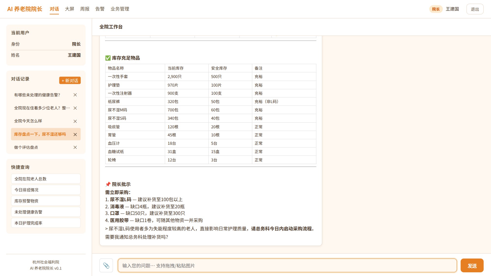
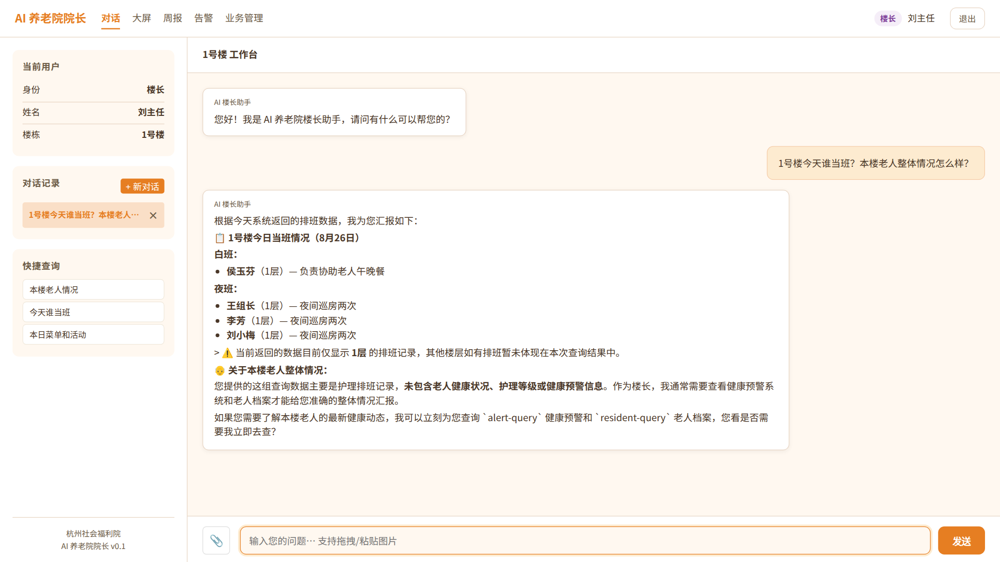
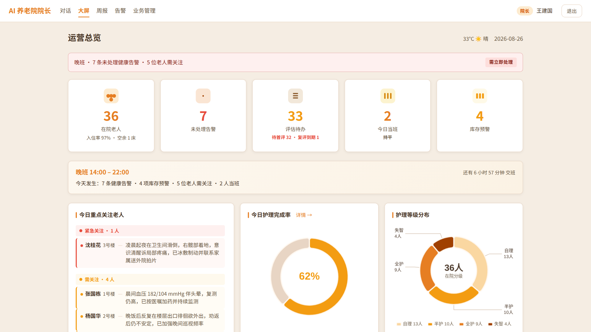
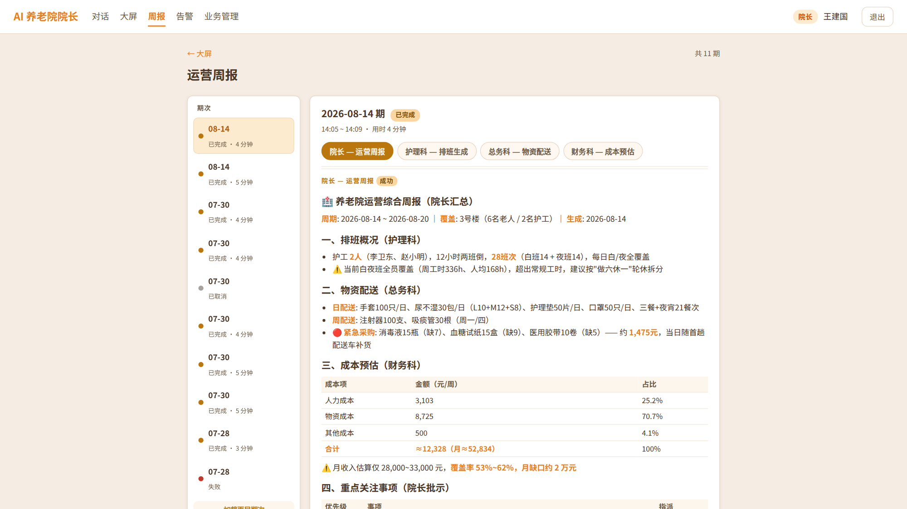
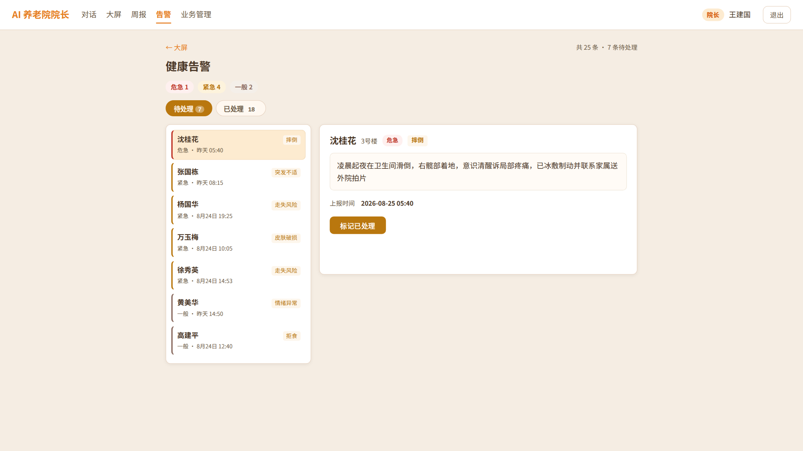
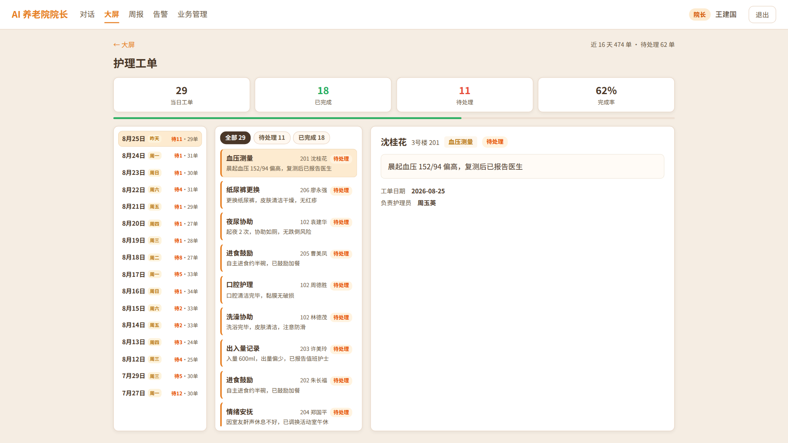
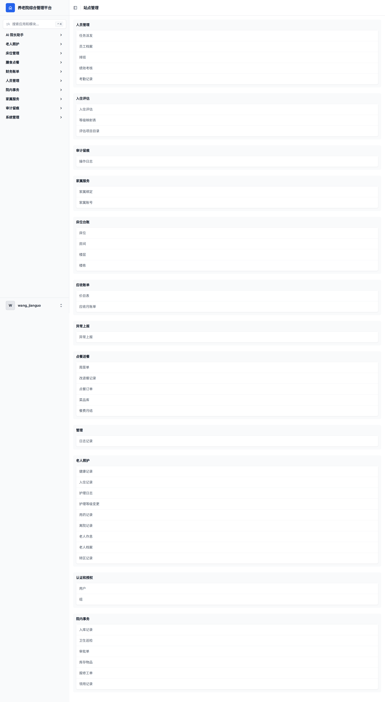
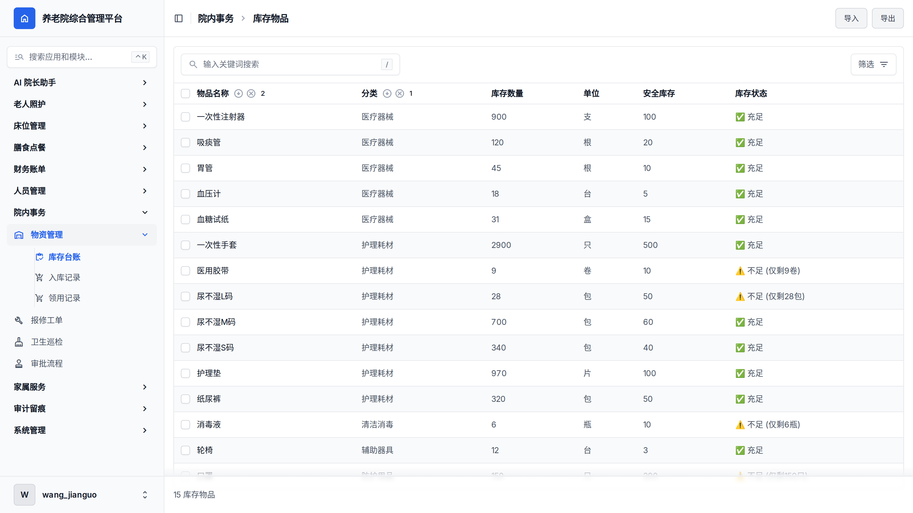
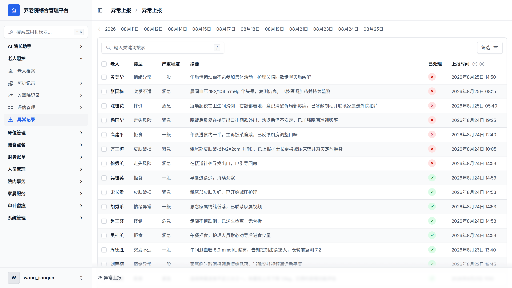

# AI 养老院院长

> 部署在养老院里的 AI 运营团队——10 个角色化数字员工，替院长管运营、替科室干活、替楼栋值班。
> 业务数据全程留在院内，不依赖云端。

**出品**：戴恩医疗科技（浙江）股份有限公司
**适用读者**：养老机构管理层、信息化负责人、商务合作方
**版本**：v0.1 · 2026-08

---

## 一、养老院运营的四个断层

一家千人规模的养老院，日常运营的瓶颈不在"缺系统"，而在"人和信息对不上"：

| 断层 | 现实场景 |
|------|----------|
| **信息散落** | 排班在 Excel 里、库存在本子上、老人的情况在护理员的脑子里。想问"3 号楼今天谁当班"，要打三个电话。 |
| **报表靠人拼** | 院长周报需要护理、总务、财务各自报数，人工汇总大半天，数字还常常对不齐。 |
| **异常靠人报** | 老人的健康信号藏在日常照护的细节里，发现不及时、上报靠自觉、处理无留痕。 |
| **系统能查不能干** | 传统 ERP 能存数据，但不会替你干活——查一个数要会系统、要坐在电脑前、要懂菜单在哪。 |

**会用 AI 聊天 ≠ 运营流程被交付。** 我们做的事情，是让 AI 真正进入养老院的经营现场。

---

## 二、解决方案：一支 7×24 在岗的数字员工团队

「AI 养老院院长」部署在院内服务器上，用 **10 个角色化 AI Agent** 覆盖运营核心链路：

```
              院长助手（全院视角：报表/概况/批示）
             ┌──────────┼──────────┐
        护理科助手        总务科助手      通用助手
      （排班/工单/评估）  （库存/物资）  （菜单/活动/公开查询）
             │
   楼栋助手 ×6（每栋一个：本楼老人/当班/异常上报）
```

每个工作人员**用自己的身份**登录，Agent 自动携带其科室、楼栋上下文——楼长看到的就是本楼，家属看到的就是自家老人。



*院长问一句"库存盘点一下，尿不湿还够吗"——AI 直接给出全院库存报表：尿不湿 L 码已低于安全库存线的告急提醒、其他低库存物品清单、充足物品台账，并附"院长批示"补货建议，最后主动提出"需要我通知总务科处理补货吗"。*

---

## 三、六项核心能力

### 1. 对话式查询：把 ERP 装进一句话里

排班、库存、老人档案、菜单、活动、财务、告警、评估——九类业务数据，问一句就出结果，支持表格化呈现。

院长工作台左侧的会话记录，就是日常真实用法：

> "库存盘点一下，尿不湿还够吗" · "谁该复评了？还有多少老人没做过评估？" · "本月应收多少？已收多少？" · "这个月谁欠费？前 3 名" · "不健康的老人有多少位"

还支持**图片识别**：拍一张药品盒、单据、手写记录发进对话，AI 自动 OCR 识别并处理。

### 2. 角色化数据边界：同一个问题，不同的答案

这是"数字员工"和"聊天机器人"的本质区别——**它知道你是谁、你管什么**。



*同样是问"今天谁当班"：楼长刘主任的助手只汇报 1 号楼排班，并主动说明数据边界、提出可以继续查健康预警；院长问则是全院口径。家属登录则只能看到自家老人的信息。*

### 3. 运营大屏：全院一屏，30 秒自愈刷新



*在院老人、未处理告警、评估待办、今日当班、库存预警五个 KPI；重点关注老人、护理完成率、护理等级分布（暖色深浅=照护轻重）、今日餐食/点餐/库存/文娱活动。楼长登录自动收窄为本楼口径。*

### 4. 多 Agent 协作周报：四步流转，全程自动

院长一句话触发，四个 Agent 接力完成：

```
院长触发 → ① 护理科：生成本周排班 → ② 总务科：物资配送计划
        → ③ 财务科：成本预估 → ④ 院长：汇总产出运营周报
```



*每期周报含四份部门产出（标签页切换），护理排班、物资配送、成本预估一目了然；执行过程（⚙ 旁白）单独折叠留档，正文干净可读。全程约 4 分钟，期次列表可回溯历史。*

### 5. 健康告警与护理工单：异常有分级，处理有留痕



*告警按 危急/紧急/一般 三级分色管理，待处理/已处理双台账；点击"标记已处理"真实落库——处理人、处理时间自动署名。*



*护理工单按日期归档，当日总数、完成数、完成率一屏可读；每单关联老人、楼栋房号、负责护理员与执行记录。*

### 6. 家属服务：隔着围墙的安心

家属用手机号即可登录 AI 对话，问"这周老人吃饭怎么样"，AI 基于真实点餐记录回答（含少盐等特殊餐备注）；**只能查询、不能代办，只能看自家、不能看他人**——隐私边界由系统强制，不靠自觉。

---

## 四、业务底座：可定制的轻量管理系统

AI 是这套系统最亮的工作面，但不是唯一的工作面——底下是一套完整的院内 ERP。



*后台首页：十大业务模块、50+ 功能目录，按养老院的科室与业务流组织——老人照护、床位、膳食点餐、财务账单、人员排班、物资管理、家属服务、审计留痕，开箱即用，也按机构定制。*

- **按机构定制**：目录、字段、流程按科室结构与业务流配置，不是通用软件套壳
- **轻量即用**：浏览器打开即用，无需客户端与专项培训；iPad 床旁可直接操作
- **可分可合**：ERP 独立交付，AI 在其上生长；也可先上 ERP，AI 后续叠加

### 一套数据，两个工作面



院长在对话里问「库存盘点一下，尿不湿还够吗」，AI 回答「L 码库存 28 包，已低于安全库存线 50 包」——右边就是同一张台账：L 码 28/50 黄色预警，医用胶带、消毒液同步亮警。**AI 不另建数据**：Agent 每句回答查自 ERP 真实业务库；对话里「标记已处理」直写 ERP 异常台账，处理人、时间自动署名留痕。



*异常记录按 危急 / 紧急 / 一般 分级，已处理（√）/未处理（×）双状态管理——对话层的每次"标记已处理"都落在这里。*

---

## 五、技术底座

```
┌─────────────────────────────────────────────┐
│  交互层    对话工作台 · 运营大屏 · 自动周报 · 家属端  │
├─────────────────────────────────────────────┤
│  Agent 层  10 个角色 Agent · 多 Agent 工作流引擎     │
├─────────────────────────────────────────────┤
│  能力层    11 项护理业务技能 · RAG 知识库（向量检索+重排序） │
│           · 图片 OCR · 健康关键词告警中间件          │
├─────────────────────────────────────────────┤
│  数据层    与院内 ERP 深度对接（业务数据唯一真源）      │
│           · 专属业务库（PostgreSQL）· 缓存（Redis）  │
├─────────────────────────────────────────────┤
│  部署层   院内一体机 · 本地 Qwen3.8-27B 推理 · 数据不出院│
└─────────────────────────────────────────────┘
```

**几个关键设计**：

- **业务数据唯一真源**：Agent 的每一句回答都来自院内 ERP 的真实业务数据（排班、点餐、评估、账单），不靠大模型"编"。数据对不上时宁可说"暂未查到"。
- **数据不出院**：老人的健康与照护数据是最敏感的个人信息。本系统全部业务数据存储与计算均在院内服务器完成；交付版本采用**本地部署、特优化的开源大模型 Qwen3.8-27B**，推理跑在院内一体机上，从模型到数据整链路不出院。
- **权限与审计**：每个会话经角色门校验（员工/楼长/家属分流），全部操作进审计日志，数据库层行级权限控制。
- **知识库**：院内制度、护理规范等文档可导入 RAG 知识库（中文向量模型 + 重排序），Agent 回答有据可依。

---

## 六、已在真实规模环境落地

部署演示环境按对接机构的真实运营体量构建：

| 机构规模 | 数值 |
|------|------|
| 占地 | 60 亩（建筑面积 5.4 万㎡） |
| 照护分区 | 4 区（自理 / 介助 / 介护 / 认知障碍） |
| 床位 | 1,300 余张 |
| 员工 | 近 300 名（护理/医疗康复/膳食/社工/安保） |
| 数字员工 | 10 个角色 Agent 全量上线 |

> **演示数据声明**：本文档界面截图来自真实运行系统；演示环境中的机构名、老人与员工信息均为演示数据，非真实个人信息。演示环境中的库存、告警、工单等业务数据为按真实口径构造的演示数据。

---

## 七、合作咨询

我们提供从环境部署、ERP 数据对接到 Agent 角色定制的完整落地服务，欢迎预约现场或线上演示。


**出品方**：戴恩医疗科技（浙江）股份有限公司
**联系方式**：（商务洽谈请在此处补充）

---

*AI 养老院院长 · 让 Agent 真正进入养老院经营现场 · 戴恩医疗科技（浙江）股份有限公司出品*
